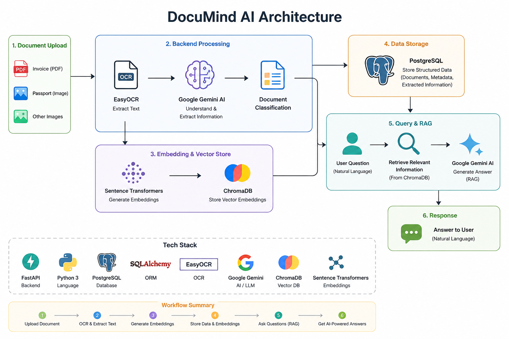
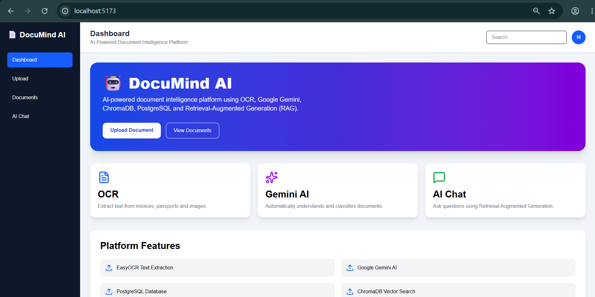
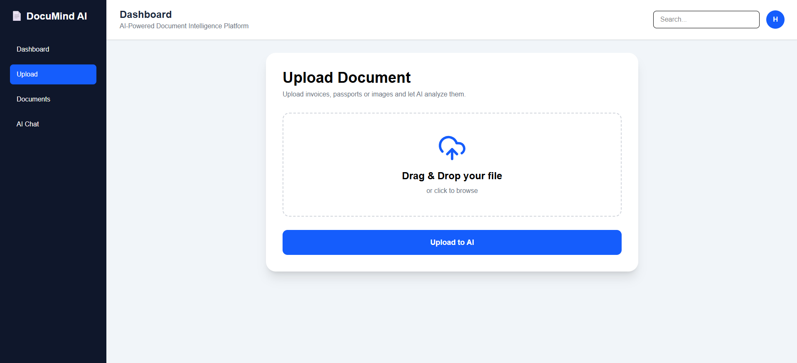
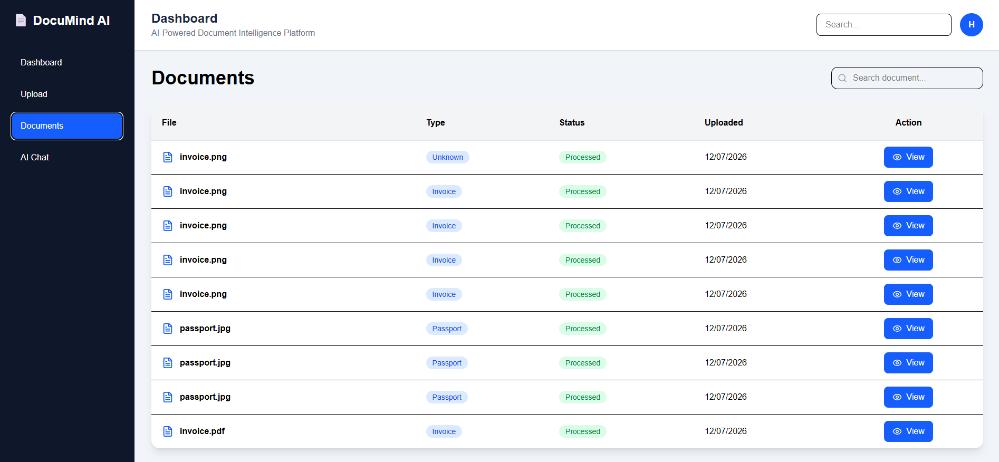
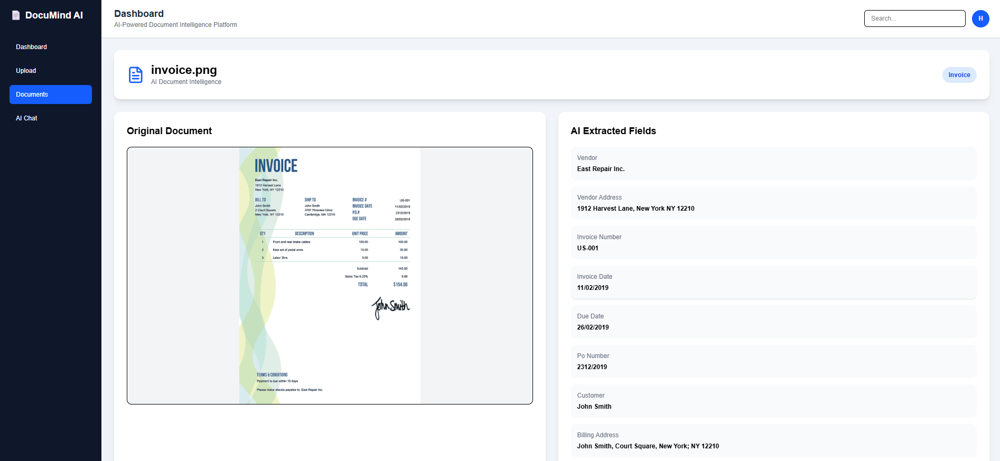
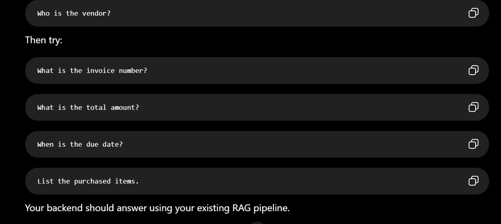

<div align="center">


### AI-Powered Document Intelligence System

**Extract • Understand • Search • Chat with Documents**


</div>

---

# 📌 Overview

DocuMind AI is a modern **AI-powered Document Intelligence System** built with **FastAPI**, **React**, **Google Gemini**, **EasyOCR**, **PostgreSQL**, and **ChromaDB**.

The application automatically extracts text from images and PDF documents, understands document contents using AI, stores structured information in PostgreSQL, indexes documents in ChromaDB for semantic retrieval, and enables users to interact with their documents using **Retrieval-Augmented Generation (RAG)**.

Designed with a clean full-stack architecture, DocuMind AI demonstrates practical implementation of OCR, Large Language Models, vector databases, semantic search, and modern AI-powered document analysis.

---

# 🚀 Key Features

| Feature                   | Status |
| ------------------------- | :----: |
| Image Upload              |    ✅   |
| PDF Upload                |    ✅   |
| OCR Text Extraction       |    ✅   |
| AI Information Extraction |    ✅   |
| Original Document Preview |    ✅   |
| Document Dashboard        |    ✅   |
| AI Chat (RAG)             |    ✅   |
| PostgreSQL Storage        |    ✅   |
| ChromaDB Vector Search    |    ✅   |

---

# 🏗️ System Architecture



---

# 🎥 Demo

> **GitHub may not preview videos directly inside the README.**

📥 **Download the complete demo video**

[demo.mp4](docs/demo.mp4)

---

# 📸 Screenshots

## Dashboard



## Upload



## Documents



## Document Details



## AI Chat



---

# ✨ Features

## 📄 Document Upload

* Upload PNG, JPG, JPEG images
* Upload PDF documents
* Drag & Drop support
* Instant file preview
* Fast document processing

---

## 👁 OCR Extraction

* EasyOCR integration
* Image OCR
* PDF OCR
* Multi-page PDF support
* Accurate text extraction

---

## 🤖 AI Document Understanding

* Google Gemini integration
* Automatic document classification
* Invoice information extraction
* Passport information extraction
* Structured JSON output

---

## 💬 AI Chat (RAG)

* Retrieval-Augmented Generation
* ChromaDB vector search
* Semantic document retrieval
* Natural language questions
* Context-aware AI responses

---

## 📊 Document Dashboard

* Upload history
* Document search
* Original document preview
* OCR text viewer
* AI extracted fields
* Document details page

---

## 🗄️ Backend Services

* FastAPI REST API
* SQLAlchemy ORM
* PostgreSQL database
* ChromaDB vector database
* Modular service architecture

---

# 📂 Project Structure

```text
DocuMind-AI/
│
├── app/
│   ├── api/
│   ├── database/
│   ├── models/
│   ├── services/
│   └── main.py
│
├── frontend/
│   ├── public/
│   ├── src/
│   └── package.json
│
├── docs/
│   ├── dashboard.png
│   ├── upload.png
│   ├── documents.png
│   ├── details.png
│   ├── chat.png
│   ├── hero.png
│   └── demo.mp4
│
├── uploads/
├── chroma_db/
│
├── architecture.png
├── requirements.txt
├── README.md
└── .env.example
```

---

# 💻 System Requirements

* Python 3.11+
* Node.js 20+
* PostgreSQL
* Google Gemini API Key

---

# 🛠 Technologies Used

## Frontend

* React
* Vite
* Tailwind CSS
* React Router
* Axios
* Lucide React

## Backend

* FastAPI
* SQLAlchemy
* Uvicorn

## Database

* PostgreSQL
* ChromaDB

## Artificial Intelligence

* Google Gemini
* EasyOCR
* Sentence Transformers

## File Processing

* PyMuPDF
* Pillow

---

# 📦 Installation

## Clone Repository

```bash
git clone https://github.com/huzaifa-ai-tech/DocuMind-AI.git
```

Move into the project directory

```bash
cd DocuMind-AI
```

Create a virtual environment

```bash
python -m venv venv
```

Activate the environment

### Windows

```bash
venv\Scripts\activate
```

### Linux / macOS

```bash
source venv/bin/activate
```

Install Python dependencies

```bash
pip install -r requirements.txt
```

Install frontend dependencies

```bash
cd frontend
npm install
```

Run the backend

```bash
uvicorn app.main:app --reload
```

Run the frontend

```bash
npm run dev
```

Backend URL

```
http://127.0.0.1:8000
```

Frontend URL

```
http://localhost:5173
```

---

# ▶ Usage

1. Start PostgreSQL.
2. Launch the FastAPI backend.
3. Start the React frontend.
4. Upload an image or PDF.
5. Extract document information using AI.
6. View OCR results.
7. Chat with the uploaded document.

---

# 🔄 Workflow

1. Upload Image / PDF
2. OCR Text Extraction (EasyOCR)
3. AI Information Extraction (Google Gemini)
4. Store Structured Data (PostgreSQL)
5. Create Vector Embeddings (ChromaDB)
6. Ask Questions
7. Retrieve Relevant Context
8. Generate AI Response

---

# 🎯 Future Improvements

* User Authentication
* Multi-user Workspace
* Export to PDF
* Export to CSV
* Docker Support
* Cloud Deployment
* Multi-language OCR
* Streaming AI Responses
* Advanced Analytics Dashboard

---

# 👨‍💻 Author

**Huzaifa**

GitHub: https://github.com/huzaifa-ai-tech

---

# 🙏 Acknowledgements

This project makes use of the following open-source technologies:

* **Google Gemini** — AI document understanding
* **FastAPI** — High-performance backend framework
* **React** — Modern frontend framework
* **EasyOCR** — Optical Character Recognition
* **ChromaDB** — Vector database for semantic search
* **PostgreSQL** — Relational database
* **Sentence Transformers** — Embedding generation
* **PyMuPDF** — PDF processing
* **Pillow** — Image processing
* **Python** — Core programming language

Special thanks to the open-source community for providing these excellent tools.

---

# 📄 License

This project is licensed under the **MIT License**.

---

# ⭐ Support

If you found this project useful, please consider giving it a **⭐ Star** on GitHub. Your support helps the project reach more developers and motivates future improvements.