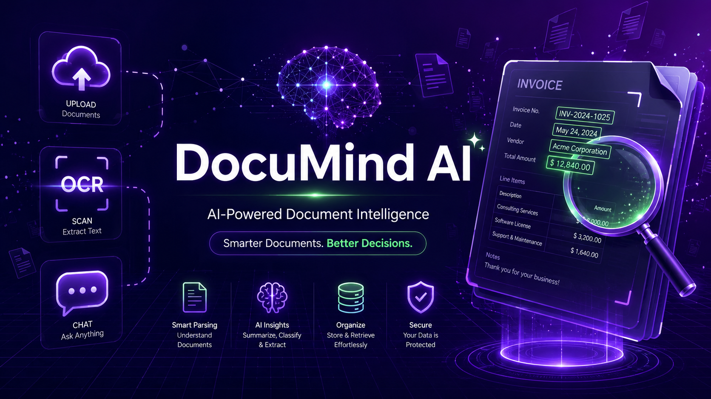
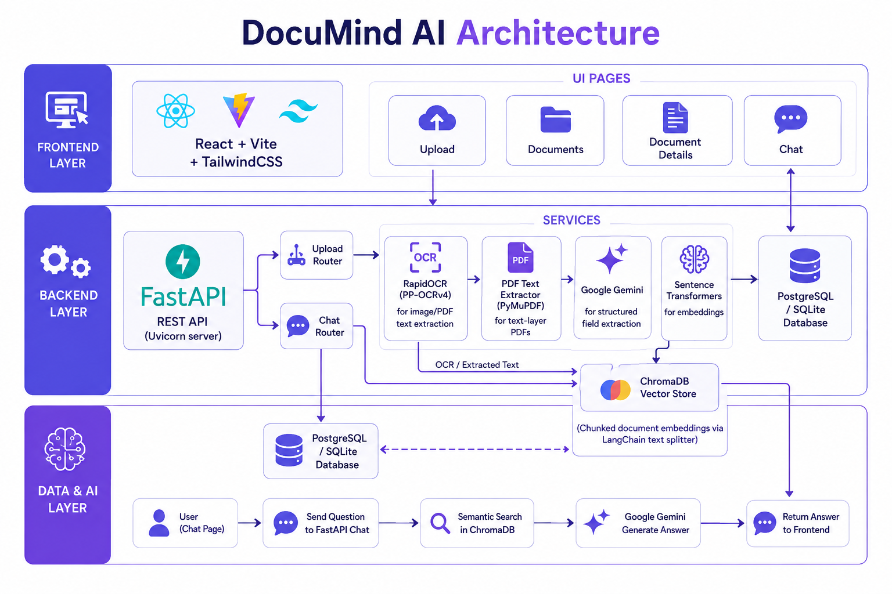
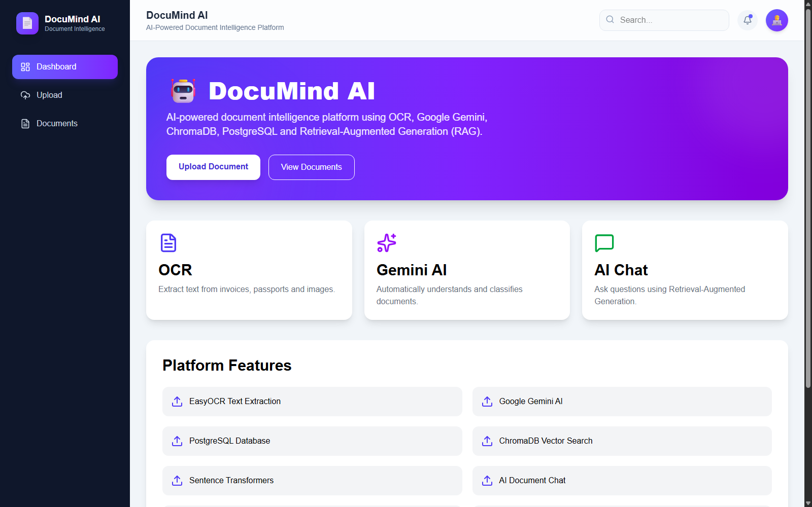
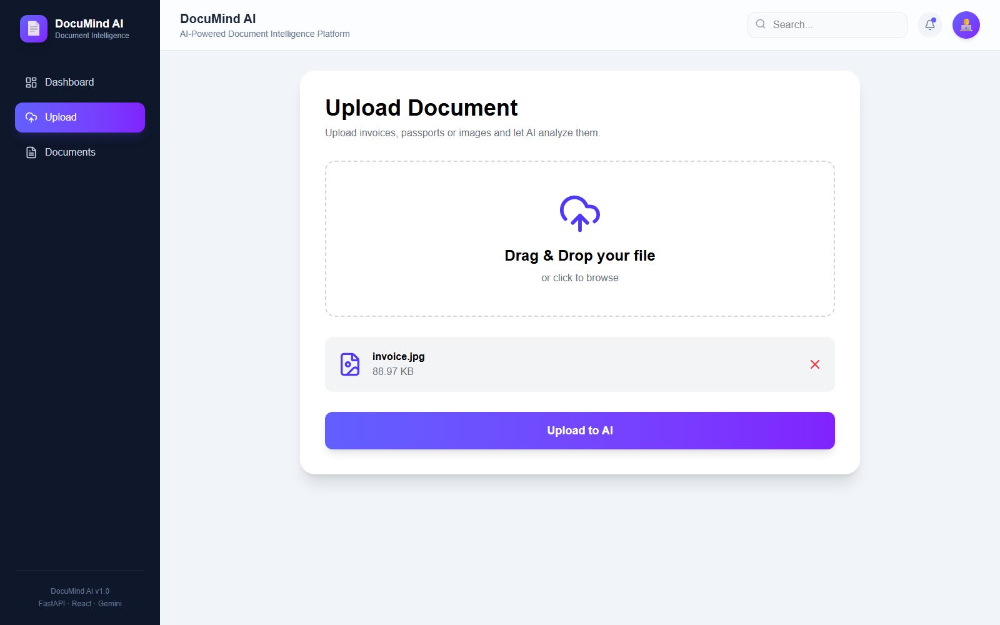
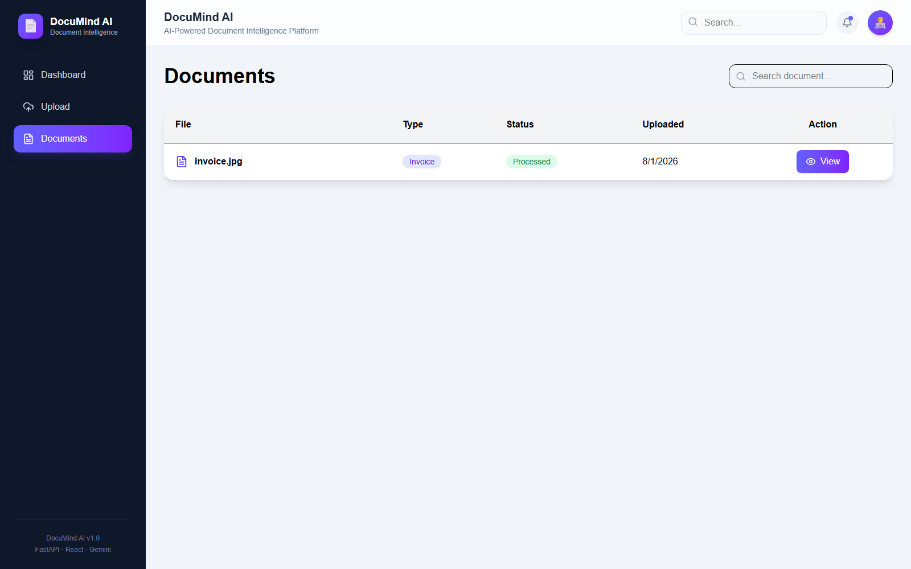
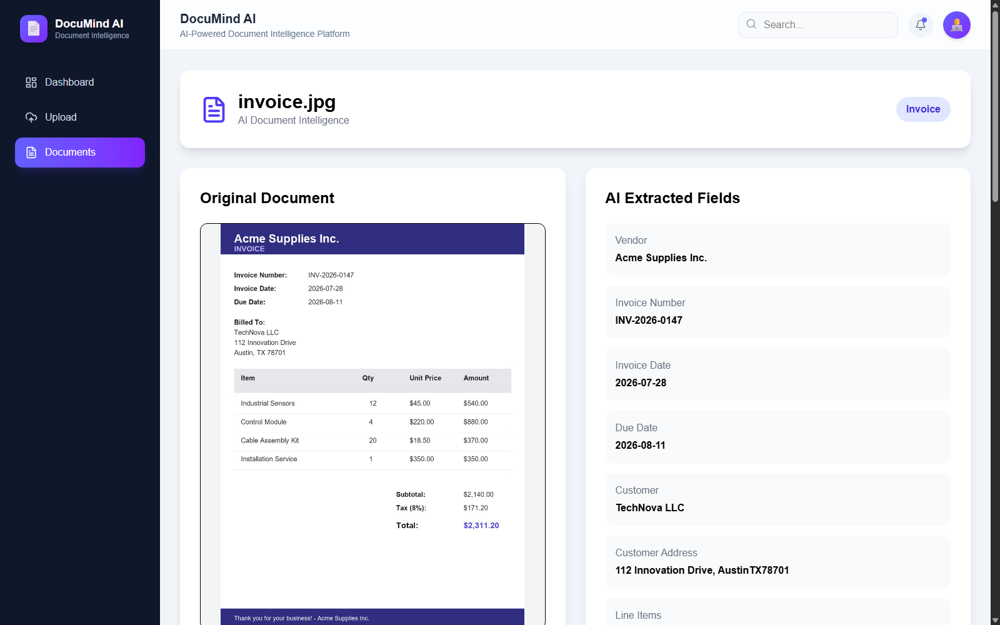
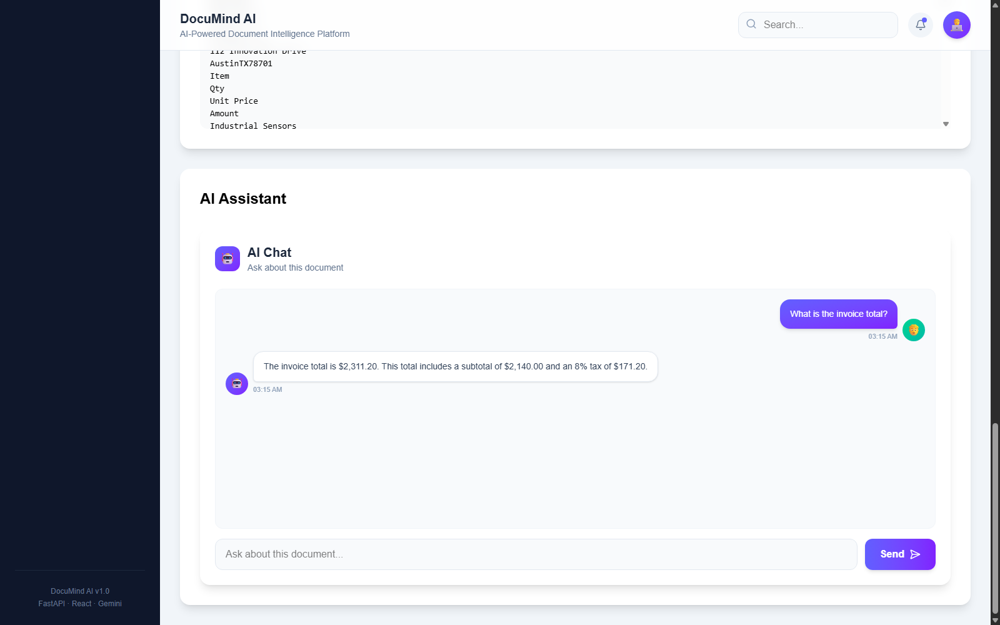

# 🚀 DocuMind-AI — AI-Powered Document Intelligence System

<p align="center">
  
</p>


<h3 align="center">
OCR Text Extraction, AI Field Extraction & RAG Chat over Your Documents
</h3>


<p align="center">


</p>


---


A modern **AI-powered Document Intelligence System** built with **FastAPI**, **React**, **Google Gemini**, **RapidOCR**, **PostgreSQL**, and **ChromaDB**.


The platform automatically extracts text from images and PDF documents, understands document contents using AI, stores structured information in PostgreSQL, indexes documents in ChromaDB for semantic retrieval, and enables users to interact with their documents using **Retrieval-Augmented Generation (RAG)**.


---


# 📌 Overview


Documents — invoices, passports, forms, and reports — hold critical information trapped in unstructured formats that are difficult to search, extract, and query.


Typical applications include:


* 🧾 Invoice and receipt data extraction
* 🛂 Passport and ID information extraction
* 📋 Form and contract processing
* 🔍 Document search and retrieval
* 💬 Asking questions directly about a document
* 🏢 Enterprise document management


Traditional document processing is challenging because of:


* Scanned PDFs and images with no text layer
* OCR accuracy on low-quality scans
* Extracting structured fields from free-form documents
* Searching meaning (semantics) rather than keywords
* Understanding long documents


This project automates the complete workflow by combining **OCR extraction**, **Google Gemini AI understanding**, **PostgreSQL storage**, and **ChromaDB vector search** into an end-to-end document intelligence platform.


---


# 🚀 Key Features


| Feature                    | Status |
| -------------------------- | :----: |
| Image Upload               |    ✅   |
| PDF Upload                 |    ✅   |
| OCR Text Extraction        |    ✅   |
| PDF Text-Layer Extraction  |    ✅   |
| AI Information Extraction  |    ✅   |
| Original Document Preview  |    ✅   |
| Document Dashboard         |    ✅   |
| AI Chat (RAG)              |    ✅   |
| PostgreSQL Storage         |    ✅   |
| ChromaDB Vector Search     |    ✅   |


---


# 🏗️ System Architecture


<p align="center">
  
</p>


The platform is organised into three primary layers:


* **Frontend Layer** — React + Vite interface for uploading, viewing and chatting with documents.
* **Backend Layer** — FastAPI REST API handling uploads, text extraction, AI extraction and RAG chat.
* **AI Processing Layer** — RapidOCR, PyMuPDF text extraction, Google Gemini and ChromaDB powered retrieval-augmented generation.


**Processing pipeline:** Uploaded files are extracted (PDF text-layer via PyMuPDF, or RapidOCR for images and scanned PDFs) → Google Gemini extracts structured fields → document data is stored in PostgreSQL → embeddings are indexed in ChromaDB → the AI chat retrieves relevant chunks and answers using only document content.


---


# 🌐 Frontend Layer


### Technology Stack


* React
* Vite
* Tailwind CSS
* React Router
* Axios
* Lucide React Icons


### Responsibilities


* Document upload (drag & drop)
* Original document preview
* OCR text viewer
* AI extracted fields display
* Document history and search
* RAG chat interface
* User interaction


---


# ⚙️ Backend Layer


### Technology Stack


* FastAPI
* SQLAlchemy
* PostgreSQL
* Uvicorn


### Responsibilities


* REST API management
* File upload handling
* Text extraction orchestration
* AI field extraction
* Structured data storage
* Embedding indexing
* RAG chat execution
* Static file serving


---


# 🤖 AI Processing Layer


The complete AI workflow is performed using OCR, Gemini and vector retrieval.


```text
Upload Image / PDF
          │
          ▼
PDF Text-Layer (PyMuPDF) or OCR (RapidOCR)
          │
          ▼
Google Gemini Field Extraction
          │
          ▼
Structured Data → PostgreSQL
          │
          ▼
Embeddings → ChromaDB
          │
          ▼
RAG Chat (retrieve + answer)
          │
          ▼
Document Dashboard
```


For **RAG chat**, the workflow instead begins with a user question over the indexed document:


```text
User Question
          │
          ▼
Embedding Query
          │
          ▼
ChromaDB Semantic Retrieval
          │
          ▼
Relevant Chunks
          │
          ▼
Google Gemini Answer Generation
          │
          ▼
Context-Aware Response
```


---


# 🤖 AI Components


The project performs **AI inference only**.


No model training is included. Pretrained models and hosted APIs provide understanding and retrieval.


---


# 🧠 Google Gemini


**Google Gemini** is the hosted AI model used for document understanding.


### Purpose


Classify documents and extract structured fields.


### Output


* Document classification
* Invoice and passport information extraction
* Structured JSON output
* RAG answer generation


---


# 👁️ RapidOCR (PP-OCRv4)


**RapidOCR** is a pretrained OCR engine for text extraction from images and scans.


### Purpose


Extract text where no text layer exists.


### Output


* OCR text extraction
* Image preprocessing (upscaling + contrast enhancement)
* Multi-page PDF support


---


# 🔍 Sentence Transformers & ChromaDB


**Sentence Transformers** generate embeddings; **ChromaDB** stores and retrieves them.


### Purpose


Enable semantic search and retrieval-augmented generation.


### Output


* Document embeddings
* Vector index
* Semantic retrieval for chat


---


# 📸 Screenshots


## 📊 Dashboard


<p align="center">

</p>


---


## 📤 Upload


<p align="center">

</p>


---


## 🗂️ Document History


<p align="center">

</p>


---


## 🤖 AI Document Details


<p align="center">

</p>


---


## 💬 AI Chat (RAG)


<p align="center">

</p>


---


# ✨ Features


## 📄 Document Upload


* Upload PNG, JPG, JPEG images and PDF documents
* Drag & drop support with instant file preview
* Fast document processing pipeline


---


## 👁️ OCR Extraction


* RapidOCR (PP-OCRv4) integration for image and scanned PDF text extraction
* PyMuPDF text-layer extraction for text-based PDFs (falls back to OCR for scans)
* Multi-page PDF support
* Image preprocessing (upscaling + contrast enhancement) for better accuracy


---


## 🤖 AI Document Understanding


* Google Gemini automatic document classification
* Invoice and passport information extraction
* Structured JSON output stored in the database


---


## 💬 AI Chat (RAG)


* Retrieval-Augmented Generation over uploaded documents
* ChromaDB vector search for semantic retrieval
* Context-aware answers using only document content


---


## 📊 Document Dashboard


* Upload history and document search
* Original document preview
* OCR text viewer and AI extracted fields
* Dedicated document details page


---


## 🗄️ Backend Services


* FastAPI REST API with modular service architecture
* SQLAlchemy ORM + PostgreSQL database
* ChromaDB vector database for embeddings


---


# 📂 Project Structure


```text
DocuMind-AI/
│
├── app/
│   ├── api/
│   │   ├── chat.py              # RAG chat endpoint
│   │   └── upload.py            # Upload & document endpoints
│   ├── database/
│   │   ├── database.py          # SQLAlchemy engine & session
│   │   └── session.py           # DB session dependency
│   ├── models/
│   │   └── document.py          # Document model
│   ├── services/
│   │   ├── chat_service.py      # Gemini RAG chat
│   │   ├── embedding_service.py # Sentence-transformers embeddings
│   │   ├── gemini_service.py    # AI document extraction
│   │   ├── ocr_service.py       # RapidOCR text extraction
│   │   ├── pdf_service.py       # PDF text extraction & image conversion
│   │   └── rag_service.py       # ChromaDB indexing & search
│   └── main.py                  # FastAPI application
│
├── frontend/
│   ├── public/
│   ├── src/
│   │   ├── components/
│   │   │   ├── ChatBox.jsx
│   │   │   ├── Navbar.jsx
│   │   │   └── Sidebar.jsx
│   │   ├── pages/
│   │   │   ├── Dashboard.jsx
│   │   │   ├── Documents.jsx
│   │   │   ├── DocumentDetails.jsx
│   │   │   └── Upload.jsx
│   │   └── services/
│   └── package.json
│
├── docs/
│   ├── thumbnail.png
│   ├── dashboard.png
│   ├── upload.png
│   └── history.png
│
├── uploads/                     # Uploaded files (runtime)
├── chroma_db/                   # Vector database (runtime)
├── architecture.png
├── create_tables.py             # Create database tables
├── requirements.txt
├── README.md
└── .env.example
```


---


# 🔌 Backend API Endpoints


| Endpoint                 | Method | Purpose                               |
| ------------------------ | ------ | ------------------------------------- |
| `/`                      | GET    | Project status                        |
| `/documents/upload`      | POST   | Upload an image or PDF                |
| `/documents/`            | GET    | List all documents                    |
| `/documents/{document_id}` | GET  | Get document details                  |
| `/documents/chat`        | POST   | Ask a question about a document       |


**`/documents/chat` Request Body**


```json
{
  "document_id": 1,
  "question": "What is the invoice total?"
}
```


**`/documents/chat` Response**


```json
{
  "document_id": 1,
  "question": "What is the invoice total?",
  "answer": "The invoice total is $1,250.00."
}
```


---


# 💻 Installation


## Clone Repository


```bash
git clone https://github.com/huzaifa-ai-tech/DocuMind-AI.git


cd DocuMind-AI
```


---


## Backend Setup


Create a virtual environment:


```bash
python -m venv venv
```


Activate the environment.


**Windows**


```bash
venv\Scripts\activate
```


**Linux / macOS**


```bash
source venv/bin/activate
```


Install Python dependencies:


```bash
pip install -r requirements.txt
```


Set up your environment variables:


```bash
cp .env.example .env
```


Edit `.env` with your PostgreSQL URL and Google Gemini API key.


Create the database tables:


```bash
python create_tables.py
```


Start the backend server:


```bash
uvicorn app.main:app --reload
```


Backend Server:


```
http://127.0.0.1:8000
```


---


## Frontend Setup


Install frontend dependencies:


```bash
cd frontend
npm install
```


Start the frontend:


```bash
npm run dev
```


Frontend Server:


```
http://localhost:5173
```


---


# 📊 Generated Outputs


The system automatically generates multiple outputs after each document upload.


## 📄 Extracted Text


* OCR text extraction (RapidOCR)
* PDF text-layer extraction (PyMuPDF)


---


## 🧾 Structured Data


* AI-extracted JSON fields (Google Gemini)
* Stored in PostgreSQL


---


## 🔍 Retrieval Index


* Vector embeddings
* ChromaDB semantic index


---


## 💬 RAG Answers


* Context-aware chat responses
* Semantic retrieval over document content


---


# 🛠️ Technologies Used


## 🤖 Artificial Intelligence


* Google Gemini
* RapidOCR
* Sentence Transformers
* ChromaDB


---


## ⚙️ Backend


* FastAPI
* SQLAlchemy
* Uvicorn
* PostgreSQL


---


## 🌐 Frontend


* React
* Vite
* Tailwind CSS
* React Router
* Axios
* Lucide React


---


## 📄 File Processing


* PyMuPDF
* Pillow


---


# ⚡ Advantages


* Automatic OCR text extraction from images and PDFs
* AI-powered document classification and field extraction
* Semantic search with ChromaDB vector embeddings
* RAG chat that answers only from document content
* Clean full-stack architecture (FastAPI + React)
* Structured data storage in PostgreSQL


---


# ⚠️ Limitations


* Requires a Google Gemini API key
* Requires a running PostgreSQL database
* OCR accuracy depends on image quality
* No user authentication or multi-user workspace yet


---


# 🔮 Future Improvements


Planned enhancements include:


* User Authentication
* Multi-user Workspace
* Export to PDF / CSV
* Docker Support
* Cloud Deployment
* Multi-language OCR
* Streaming AI Responses
* Advanced Analytics Dashboard


---


# 👨‍💻 Author


**Huzaifa**


GitHub:
https://github.com/huzaifa-ai-tech


---


# 🙏 Acknowledgements


This project is built using several outstanding open-source technologies:


* [Google Gemini](https://ai.google.dev/)
* [FastAPI](https://fastapi.tiangolo.com/)
* [React](https://react.dev/)
* [RapidOCR](https://github.com/RapidAI/RapidOCR)
* [ChromaDB](https://www.trychroma.com/)
* [PostgreSQL](https://www.postgresql.org/)
* [Sentence Transformers](https://huggingface.co/sentence-transformers)
* [PyMuPDF](https://pymupdf.readthedocs.io/)
* [Pillow](https://python-pillow.org/)


Special thanks to the open-source community for providing these powerful tools and frameworks that made this project possible.


---


# ⚠️ Disclaimer


This project is developed for educational purposes.


AI-generated results and OCR extraction may not always be 100% accurate and should be verified before use in production environments.


---


# ⭐ Support


If you found this project useful, please consider giving it a **⭐ Star** on GitHub.


Your support helps improve the project and motivates future development.
